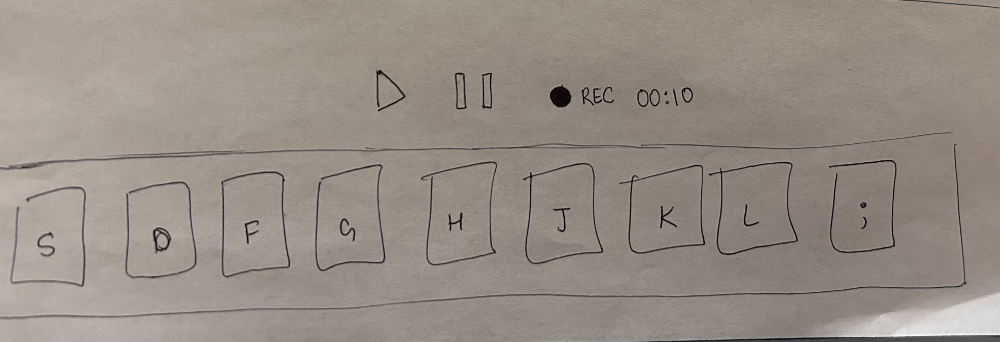

:warning: Everything between << >> needs to be replaced (remove << >> after replacing)

# << Project Title >>
## CS110 Final Project  << Semester, Year >>

## Team Members

Yashasvi Agarwal, Elizabeth Link

***

## Project Description

Music Mixer - music pad containing different buttons that correspond to keyboard. Buttons play differeny notes to create music. User can hit record to create song and can hear it back.

***    

## GUI Design

In gui.jpg

### Initial Design

### Final Design

## Program Design

### Features

1. User interface
2. Obstacle collisions
3. Start Menu
4. Learning mode - instructional text pop up
5. Looping and sequencing

### Classes

Key
- box that can be interacted with to play sound

Record
- Records audio
- Will have timer/stopwatch

Play / Pause
- Plays back recorded audio
- Stops played back audio

## ATP