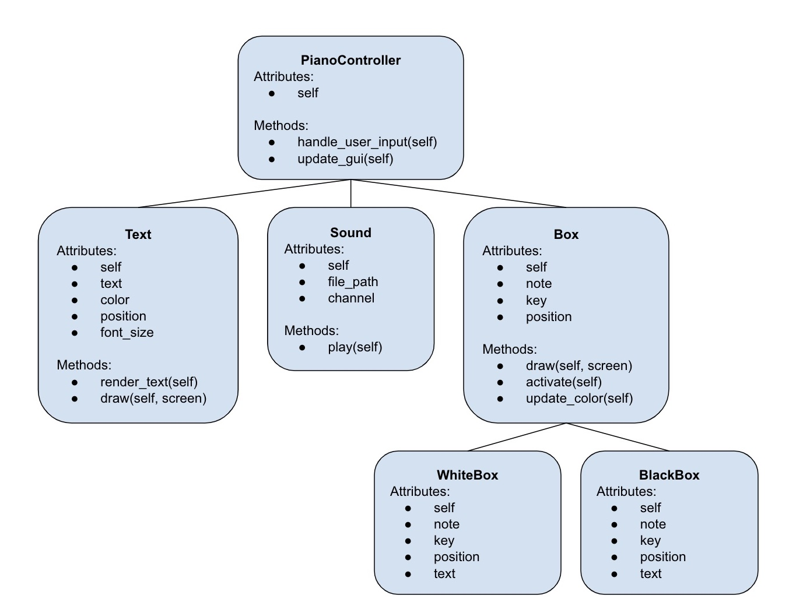

# PIANO SIMULATOR
## CS110 Final Project  Fall, 2023

## Team Members
Yashasvi Agarwal, Elizabeth Link

## Project Description
Basic piano simulator that allows user to play musical notes using either the keyboard or by clicking on the piano keys on the screen.

## Additional Modules
Pygame:
   - Set of Python modules designed for writing video games.
   - Pete Shinners. https://www.pygame.org/docs/

Playsound:
   - Used for playing sound files.
   - Taylor Marks. https://pypi.org/project/playsound/

## Class Relationship Diagram

## Data Permanence

Sound files stored in the "notes" folder within the "assets" folder.

## Final GUI Design

## Program Design

- main.py
   - assets/
      - notes/  # contains sound files
         - (W1)_noteC_letterA.mp3
         - (W2)_noteD_letterS.mp3
         - ...
         - (B5)_noteA#_letterU.mp3
      - images/ # contains image files
         - class_relationship_diagram.jpg
         - finalGUI.jpg
- README.md

### Classes

- Sound
- Text
- Box
- WhiteBox
- BlackBox
- PianoController

## ATP

1. Click a key - expect note to be played.
2. Press letter on keyboard corresponding to a piano key - expect note to be played.
3. Click on display screen outside of piano keys - expect no note to play.