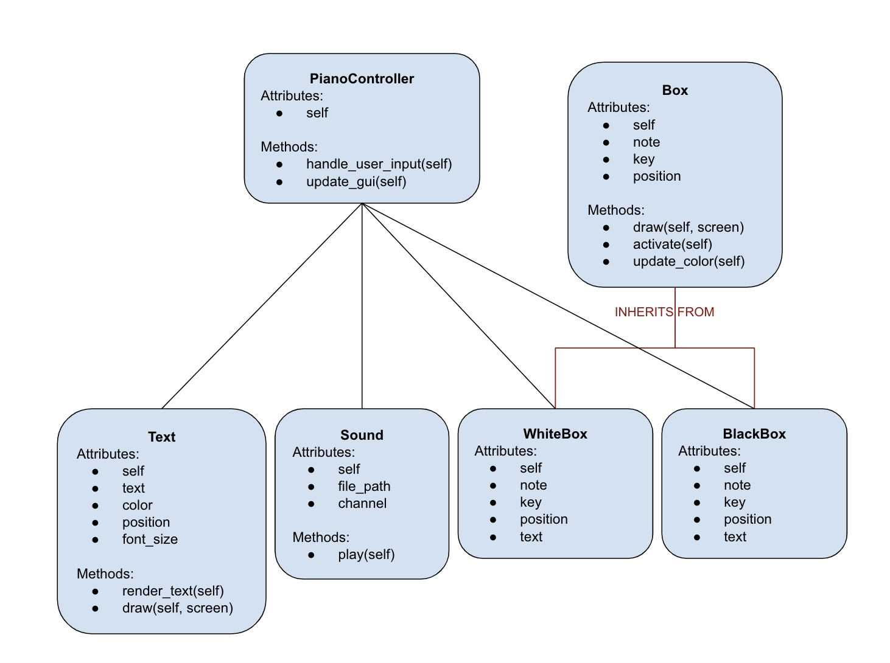

# PIANO SIMULATOR
## CS110 Final Project  Fall, 2023

## Team Members
Yashasvi Agarwal, Elizabeth Link

***

## Project Description
Basic piano simulator that allows user to play musical notes using either the keyboard or by clicking on the visual of the piano keys on the screen.

## Additional Modules
Pygame:
   - Set of Python modules designed for writing video games.
   - Pygame Community. Pete Shinners (2011). PyGame - Python Game Development. https://www.pygame.org/docs/

Playsound:
   - Used for playing sound files.
   - Giampaolo Rodola. "playsound Documentation." https://pypi.org/project/playsound/

## Class Relationship Diagram

## Data Permanence

## Final GUI Design

## Program Design

### Features

1. User interface
2. Obstacle collisions
3. Start Menu
4. Learning mode - instructional text pop up
5. Looping and sequencing

### Classes

- Sound
- Text
- Box
- WhiteBox
- BlackBox
- PianoController

## ATP